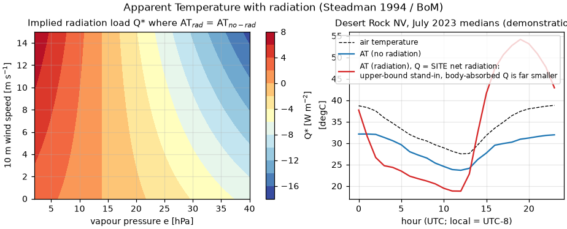

# Validation: `calculate_apparent_temperature_radiation`

Steadman's **Apparent Temperature including radiation**, as published
operationally by the Australian Bureau of Meteorology
([bom.gov.au/info/thermal_stress](http://www.bom.gov.au/info/thermal_stress/)):

    AT = Ta + 0.348·e − 0.70·ws + 0.70·Q/(ws + 10) − 4.25

with Ta in °C, e the vapour pressure in hPa (BoM Magnus approximation), ws
the 10 m wind speed in m s⁻¹ and **Q the net radiation absorbed per unit
body-surface area in W m⁻²** — a caller-supplied input, *not* an NWP surface
flux. Primary reference: Steadman (1994), *Aust. Met. Mag.* 43, 1–16,
[doi:10.1071/es94001](https://doi.org/10.1071/es94001).

This index is *defined by* the published formula, so the validation
establishes: exact fidelity to the authority's published form, coherence with
its non-radiative sibling, and a real-data demonstration of the radiation
term's behaviour.

## Validation design

| Part | Question | Method |
|---|---|---|
| 1 | Faithful transcription? | Independent transcription of the BoM-published formula (incl. BoM vapour pressure), grid Ta −10…45 °C × ws 0…20 m s⁻¹ × RH 5…100 % × Q −100…1000 W m⁻² (N = 222 180); plus the exact Q = 0 reduction |
| 2 | Coherent with `calculate_apparent_temperature` (non-radiative)? | Solving AT_rad(Q\*) = AT_norad gives Q\*(e, ws) = (0.25 − 0.018·e)(ws + 10)/0.70; identity verified numerically and Q\* mapped over realistic (e, ws) |
| 3 | Radiation term behaviour on real data? | Desert Rock NV, July 2023 (SURFRAD): diurnal AT with/without radiation using the *site* net radiation as a stand-in for Q — **demonstration only** (see limitations) |

Pre-registered criteria: parts 1–2 ≤ 1e-9 °C.

## Results

- Part 1: max |Δ| = **2.8e-14 °C** over 222 180 combinations; Q = 0 reduction
  to AT = Ta + 0.348·e − 0.70·ws − 4.25 exact to the same level. Stats:
  [`results/at_radiation_stats.csv`](results/at_radiation_stats.csv).
- Part 2: identity holds to **5.7e-14 °C**. The implied crossing load Q\* is
  **−52…+9 W m⁻² (median ≈ 1 W m⁻²)** over the realistic (e, ws) envelope:
  the non-radiative form corresponds to a near-zero absorbed radiation load
  (indoor/shade), exactly Steadman's design intent — the two thermofeel
  functions are one coherent family, not competing fits.
- Part 3: the term responds linearly and strongly — feeding the *site* net
  radiation (500–700 W m⁻² at midday) as Q raises AT by ~25 °C over the
  non-radiative form, and nocturnal radiative cooling pulls it slightly
  below. This is deliberately an **upper-bound stand-in**: the body-absorbed
  Q of Steadman's model is far smaller (order 10²  W m⁻² in full sun once
  posture, projected area and albedo are accounted for), so the plot is a
  demonstration of the term's mechanics and of *why the choice of Q is the
  dominant modelling decision* — not a claim that site net radiation is an
  appropriate Q.



**Verdict: PASS** (parts 1–2; part 3 informational).

## Discussion and limitations

- **Q is the user's modelling decision.** Steadman's Q is the net radiation
  absorbed by a *person* (posture, albedo, view factors), not the surface
  energy-budget net radiation; SURFRAD `totalnet` in part 3 is a physically
  related stand-in used to exercise the term with realistic magnitudes, not a
  validated body-load model. The docstring is explicit that callers must
  supply their own Q (e.g. from Steadman 1994's radiation model or an MRT
  pathway).
- The formula is an empirical fit without hard input bounds (docstring);
  BoM's operational "feels like" product uses the **non-radiative** variant
  precisely because Q is hard to standardise — consistent with part 2's
  finding that AT_norad ≈ AT_rad at Q ≈ 0.
- Wind is the 10 m speed, per BoM's published definition (unlike UTCI's
  body-level wind adjustments).

## Reproduce

```bash
pip install -e ".[validation]"
python validation/apparent_temperature_radiation/validate_at_radiation.py
```

Downloads (cached): SURFRAD dra July 2023 (~12 MB).
