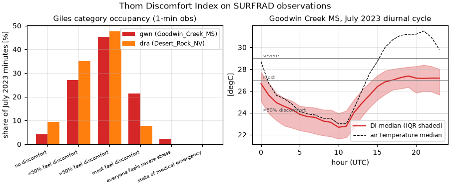

# Validation: `calculate_discomfort_index`

Thom's **Discomfort Index** (Temperature–Humidity Index) in the
Celsius/relative-humidity closed form given by Giles, Balafoutis &
Maheras (1990, [doi:10.1007/BF01093455](https://doi.org/10.1007/BF01093455)):

    DI = T − 0.55 (1 − 0.01 RH)(T − 14.5)        [T in °C, RH in %]

Index origin: Thom (1959,
[doi:10.1080/00431672.1959.9926960](https://doi.org/10.1080/00431672.1959.9926960)).
thermofeel takes Kelvin in and returns Kelvin.

## Validation design

| Part | Question | Reference |
|---|---|---|
| 1 | Does an independent implementation agree? | **pythermalcomfort** 4.0.2 `discomfort_index` (same Giles closed form), over a dense grid (T −10…50 °C × RH 0…100 %, N = 12 221) **and** 89 280 real observed (T, RH) pairs (NOAA SURFRAD, Jul 2023, humid + desert stations) |
| 2 | Are the formula's analytic identities exact? | DI(T, 100 %) = T for all T; DI(14.5 °C, RH) = 14.5 °C for all RH |
| 3 | Is it climatologically sensible on real data? | Occupancy of the Giles discomfort categories at a humid-subtropical vs an arid station, July 2023 (informational) |

The reference *rounds its output to 0.1 °C* and offers no opt-out, so the
sharpest available oracle statement — and the pre-registered criterion — is
that the residual must be **pure quantization noise**: max |Δ| ≤ 0.05 °C and
RMSE within [0.024, 0.034] °C (uniform rounding noise = 0.1/√12 = 0.0289 °C).
Identities: ≤ 1e-12 °C.

## Results

- Part 1: max |Δ| = **0.0500 °C** and RMSE(Δ) = **0.0289 °C** on both grid and
  observations — exactly the reference's rounding-noise signature (MBE ~2e-5
  °C), i.e. the two implementations agree to the reference's printed
  resolution. Stats: [`results/di_oracle_stats.csv`](results/di_oracle_stats.csv).
- Part 2: DI(T, 100 %) = T to **2.8e-14 °C**; DI(14.5, RH) = 14.5 **exactly**.
- Part 3: July 2023 category occupancy
  ([`results/di_band_occupancy.csv`](results/di_band_occupancy.csv)):
  Goodwin Creek (humid MS) reaches "most feel discomfort" 21 % and "severe
  stress" 2 % of minutes, Desert Rock (arid NV) 7.8 % and 0 % — the expected
  humid-vs-arid ordering for a humidity-weighted index, with a diurnal cycle
  where DI sits *below* air temperature in dry afternoon air.



**Verdict: PASS.**

## Discussion and limitations

- DI's simplicity (no wind, no radiation) is by design; Epstein & Moran
  (2006, [doi:10.2486/indhealth.44.388](https://doi.org/10.2486/indhealth.44.388))
  review its limits and give a *different* wet-bulb formulation of the same
  name — thermofeel implements only the Giles T/RH form and says so in the
  docstring. The categories in part 3 are Giles's, as used operationally
  (e.g. Israel Meteorological Service).
- The index is not clamped: out-of-range inputs (deep cold) return raw
  values; masking is the caller's responsibility (docstring).

## Reproduce

```bash
pip install -e ".[validation]"
python validation/discomfort_index/validate_di.py
```

Downloads (cached): SURFRAD daily files for gwn+dra July 2023 (~25 MB).
