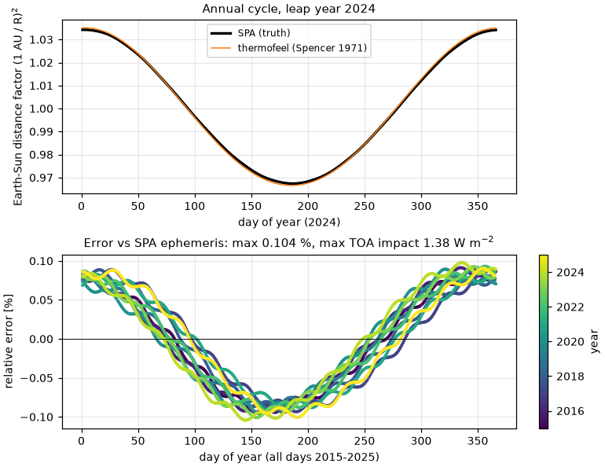

# Validation: `approximations.earth_sun_distance_factor`

The Earth–Sun distance (eccentricity) factor E₀ = (r̄/r)², i.e. the
dimensionless scaling that converts the mean-distance solar constant into the
actual extraterrestrial normal irradiance of the day, via the Spencer (1971)
Fourier series (*Search* 2(5), 172; see also Iqbal 1983). It feeds the
clearness index used by both `fdir` estimators.

## Validation design

| Tier | Question | Reference |
|---|---|---|
| 1 | Is the series transcribed correctly? | `pvlib.irradiance.get_extra_radiation(..., method="spencer")` with a unit solar constant — an independent transcription of the same published series |
| 2 | How close is the series to the true ephemeris? | (1 AU / R)² with R from the **NREL Solar Position Algorithm** (Reda & Andreas 2004, [doi:10.1016/j.solener.2003.12.003](https://doi.org/10.1016/j.solener.2003.12.003); stated R uncertainty ~1e-7 AU) via `pvlib.solarposition.nrel_earthsun_distance`, daily at 12 UTC over 2015–2025 (4 018 days, three leap years) |

Pre-registered criteria: tier 1 max relative difference ≤ 1e-12; tier 2 max
|relative error| ≤ 0.5 % (the factor spans ±3.3 %, and a 0.5 % error moves
the clearness index — hence the estimated beam fraction — by well under the
fdir estimators' intrinsic error).

## Results

- Tier 1: max |rel. difference| vs pvlib Spencer = **2.2e-16** (machine
  precision — identical published coefficients, independent code).
- Tier 2 (vs SPA ephemeris, 2015–2025 daily): max |rel. error| = **0.104 %**,
  mean |rel. error| = 0.057 %, worst impact on TOA normal irradiance
  **1.39 W m⁻²** of 1361 W m⁻². Stats:
  [`results/esdf_stats.csv`](results/esdf_stats.csv).
- Leap years: day-of-year 366 (31 Dec of 2016/2020/2024) wraps onto the day-1
  phase of the series; measured error there is +0.07…+0.09 %, comfortably
  inside the global bound (the series' 365-day phase convention, shared with
  pvlib and Iqbal).



**Verdict: PASS.**

## Discussion

The 0.1 % ceiling matches the accuracy Spencer quoted for the series and is
negligible for the estimator chain it serves (the Erbs/DISC beam split
carries 10–20 % errors, see `../fdir/`). The alternative of an
ephemeris-grade E₀ would change nothing measurable downstream while adding a
heavy dependency: the series is the right engineering choice, now with a
measured error bound.

## Reproduce

```bash
pip install -e ".[validation]"
python validation/earth_sun_distance_factor/validate_esdf.py
```

No downloads (the SPA reference is computed locally by pvlib).
