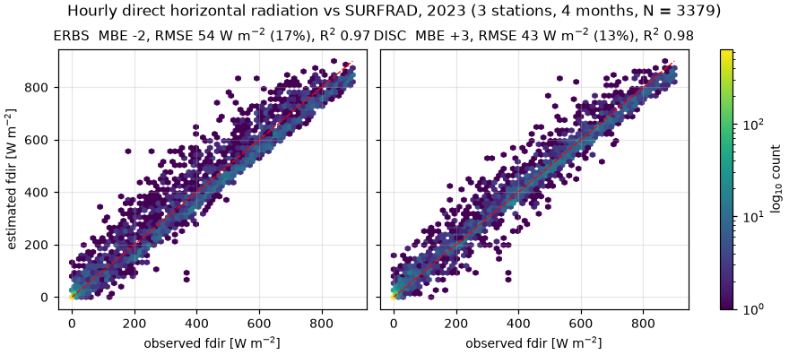
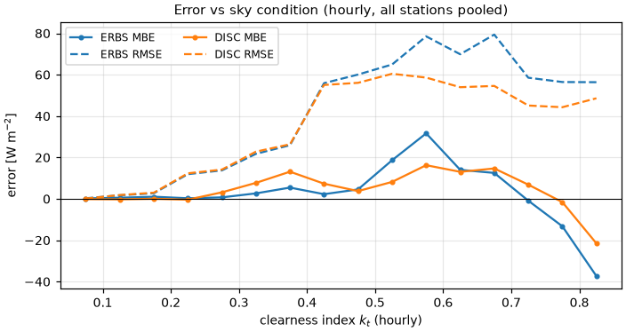
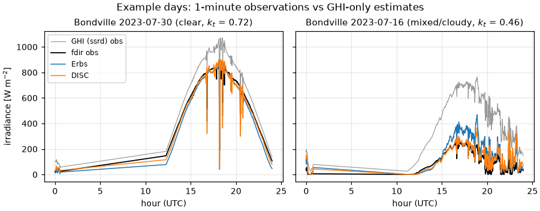
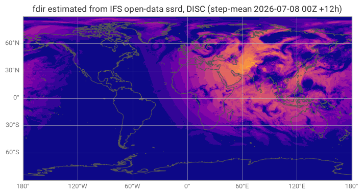
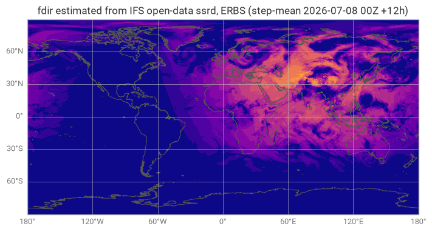
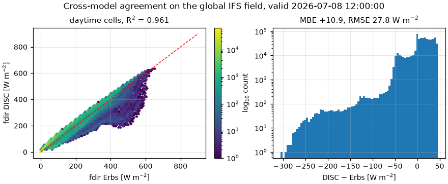

# Validation: `approximations.approximate_fdir_erbs` / `approximate_fdir_disc`

Estimators of the **direct (beam) horizontal solar radiation** (ECMWF `fdir`)
from the global horizontal radiation `ssrd` and solar geometry, for datasets
that do not provide `fdir` (e.g. ECMWF open data). `fdir` feeds
`calculate_mean_radiant_temperature` and hence UTCI / WBGT / PMV.

- Erbs, Klein & Duffie (1982), *Solar Energy* 28(4), 293–302.
  [doi:10.1016/0038-092X(82)90302-4](https://doi.org/10.1016/0038-092X(82)90302-4)
- Maxwell (1987), *A Quasi-Physical Model for Converting Hourly Global
  Horizontal to Direct Normal Insolation* (DISC), SERI/TR-215-3087.

The direct/diffuse split is **not recoverable exactly** from `ssrd` alone —
two skies with identical `ssrd` can have very different beam fractions — so
these are estimation-grade by design (the module docstring says so). The goal
of this validation is to *measure* that error honestly against independent
ground truth and to confirm the implementation is faithful.

## Validation design

| Tier | Question | Method |
|---|---|---|
| 1 | Is the code a faithful implementation? | Element-wise cross-check against `pvlib.irradiance.erbs` / `disc` **on the real observation inputs**, constants matched |
| 2 | How accurate is the estimate against nature? | NOAA **SURFRAD** ground observations: predicted `fdir` from measured GHI vs independently measured `direct_n · cos(z)` |
| 3 | Does it behave physically in the intended pipeline? | Global IFS **open-data** `ssrd` field through the exact pipeline of `examples/compute-thermal-indices.py` (earthkit stack), bounds/night/cross-model gates |

### Ground truth (tier 2)

[NOAA SURFRAD](https://gml.noaa.gov/grad/surfrad/) 1-minute observations
(public, no authentication), 2023, four seasonal months (Jan/Apr/Jul/Oct) at
three climatically contrasting stations:

| Station | Code | Climate | Lat / Lon / Elev |
|---|---|---|---|
| Desert Rock, NV | `dra` | arid, high beam fraction | 36.62, −116.02, 1007 m |
| Bondville, IL | `bon` | continental, mixed skies | 40.05, −88.37, 230 m |
| Goodwin Creek, MS | `gwn` | humid subtropical | 34.25, −89.87, 98 m |

The reference direct horizontal component is `direct_n · cos(zen)` from the
station pyrheliometer — an instrument *independent* of the pyranometer that
provides the model input GHI.

**QC** (BSRN-style): NOAA QC flags = 0 for GHI/direct/diffuse; zenith < 85°;
GHI ≥ 5 W m⁻²; three-component closure `|diffuse + direct_n·cos(z) − GHI|`
within 8 % of GHI for z < 75° and 15 % for 75–85° (where GHI > 50 W m⁻²).
523 796 1-minute records → **224 589 valid** (43 %).

Both models are **hourly** correlations, so the pass/fail gate is evaluated on
hourly means; 1-minute (off-design) and 3-hourly (ECMWF-step-like) results are
reported alongside. Aggregations require ≥ 50 valid minutes per hour (≥ 150
per 3 h); model inputs are aggregated first, then the model is applied
(matching how a user feeds step-mean `ssrd`).

### Pre-registered acceptance criteria

Calibrated from published skill of GHI-only separation models — hourly beam
estimates typically reach 20–35 % rRMSE all-sky (Ineichen 2008,
[doi:10.1016/j.solener.2007.12.006](https://doi.org/10.1016/j.solener.2007.12.006):
~23 % / 85 W m⁻² for hourly beam over >100 000 station-hours; Gueymard &
Ruiz-Arias 2016,
[doi:10.1016/j.solener.2015.10.010](https://doi.org/10.1016/j.solener.2015.10.010)):

- per station, hourly, all-sky: **rRMSE ≤ 40 %**, **|rMBE| ≤ 15 %**, **R² ≥ 0.85**;
- tier 1: pvlib agreement to ≤ 1e-8 W m⁻²;
- tier 3: exact bounds (0 ≤ fdir ≤ ssrd), exact night zeros, cross-model
  R² ≥ 0.95 and |MBE| ≤ 15 W m⁻².

## Results

### Tier 1 — implementation fidelity (on the 224 589 real inputs)

max |Δ| vs pvlib, constants matched: **Erbs 3.1e-12 W m⁻², DISC 1.1e-11 W m⁻²**
(machine precision; thermofeel's default solar constant 1361 W m⁻² vs pvlib's
1366.1/1370 conventions changes hourly pooled RMSE by only 0.3 W m⁻², see
`validate_fdir_surfrad.py` output).

### Tier 2 — SURFRAD (gate: hourly, per station)

| Model | Station | rRMSE % | rMBE % | R² | Verdict (≤40 / ≤15 / ≥0.85) |
|---|---|---:|---:|---:|---|
| Erbs | bon | 22.5 | +5.6 | 0.963 | ok |
| Erbs | dra | 11.2 | −5.1 | 0.973 | ok |
| Erbs | gwn | 21.7 | +2.6 | 0.957 | ok |
| DISC | bon | 17.8 | +5.5 | 0.977 | ok |
| DISC | dra |  8.9 | −1.8 | 0.981 | ok |
| DISC | gwn | 17.6 | +1.4 | 0.971 | ok |

Pooled (all stations):

| Resolution | Model | MBE (W m⁻²) | RMSE (W m⁻²) | rRMSE % | R² |
|---|---|---:|---:|---:|---:|
| 1-min | Erbs | +1.7 | 65.7 | 21.7 | 0.952 |
| 1-min | DISC | +9.6 | 56.4 | 18.7 | 0.966 |
| hourly | Erbs | −1.7 | 54.0 | 16.6 | 0.965 |
| hourly | DISC | +2.5 | 43.1 | 13.3 | 0.978 |
| 3-hourly | Erbs | −4.1 | 49.1 | 14.2 | 0.970 |
| 3-hourly | DISC | −1.9 | 39.1 | 11.4 | 0.981 |

Full table: [`results/fdir_surfrad_stats.csv`](results/fdir_surfrad_stats.csv).



Error vs sky condition (the classic separation-model diagnostic — largest
errors in broken cloud at intermediate clearness, smallest under overcast and
clear skies):



Example days (1-minute, off-design use: the models track the envelope but
cannot reproduce minute-scale beam intermittency from GHI alone — exactly the
"broken cloud" caveat in the module docstring):



### Tier 3 — global IFS open-data field (earthkit pipeline)

Field: IFS 0.25° `ssrd` (+`sp` for DISC), base 2026-07-08 00Z, step-mean over
+0–12 h, through `earthkit.meteo.solar.cos_solar_zenith_angle_integrated` —
identical to `examples/compute-thermal-indices.py --approximate-fdir`.

- G1 bounds: min = 0, max(fdir − ssrd) = 0 for both models (exact);
- G2 night (cos θ ≤ 0.065): max |fdir| = 0 (exact);
- G3 cross-model, daytime (N = 682 913): **R² = 0.961**, MBE = +10.9 W m⁻²
  (DISC > Erbs on step-mean inputs, consistent with the SURFRAD biases),
  RMSE = 27.8 W m⁻².





**Verdict: PASS** (all pre-registered gates met, with margin).

## Discussion and limitations

- **DISC consistently beats Erbs** (RMSE ~20 % lower) at every station and
  every resolution, as expected from the literature; both are unbiased to
  within ±6 % per station. Prefer DISC when a day-of-year and (optionally)
  surface pressure are available; it is the better default for MRT work.
- The rRMSE values here (9–23 % hourly) are *lower* than the 23–35 % quoted in
  the DNI literature because the validated quantity is the direct **horizontal**
  component (fdir = DNI·cos z): dividing by cos z inflates relative errors at
  low sun. fdir is what thermofeel's consumers (`calculate_mean_radiant_
  temperature`) actually ingest, so it is the right quantity to gate.
- Minute-scale application is off-design: the estimators smooth beam
  intermittency (see example days). Errors also grow in broken-cloud skies
  (kt ≈ 0.4–0.7), which is intrinsic to *any* GHI-only separation model —
  the split is not identifiable from GHI alone.
- The global leg cannot measure accuracy (open data has no `fdir` truth by
  design — that absence is the estimators' raison d'être); it verifies
  physical consistency in the exact production pipeline. Users with access to
  the real IFS `fdir` (MARS/CDS) should prefer it, per the module docstring.
- Snow-covered scenes can bias separation models (albedo-enhanced GHI); Jan
  at bon/dra passing the gates suggests no pathological effect here, but a
  dedicated snow study was not performed.

## Reproduce

```bash
pip install -e ".[validation]"
python validation/fdir/validate_fdir_surfrad.py   # downloads+caches SURFRAD
python validation/fdir/validate_fdir_global.py    # downloads latest open data
```

The SURFRAD leg caches ~370 daily files (~150 MB) under `validation/_cache/`;
the global leg fetches the latest 00Z run (~1.5 MB GRIB, cached per calendar
day) and its map/statistics will differ from the numbers above (live data),
while the G1/G2 gates must hold for any field. Data: NOAA GML SURFRAD (public; please credit NOAA GML);
ECMWF open data (CC BY 4.0, attribute ECMWF).
