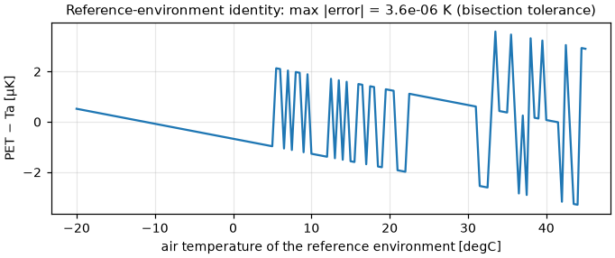
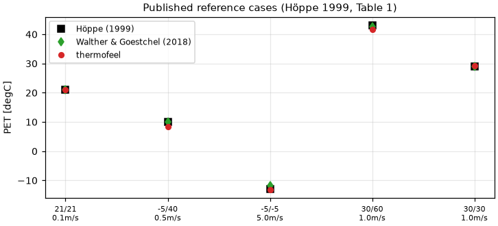
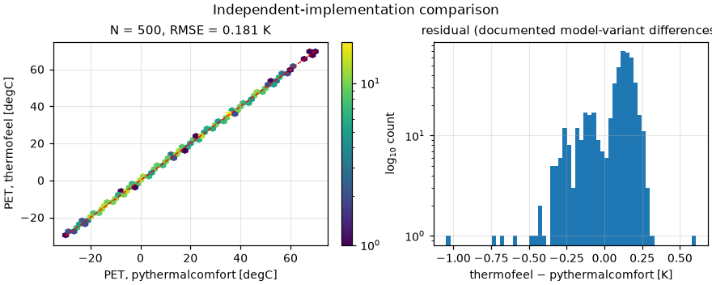

# Validation: `calculate_pet`

The **Physiological Equivalent Temperature** (Höppe 1999,
[doi:10.1007/s004840050118](https://doi.org/10.1007/s004840050118)) — the air
temperature of a standard indoor reference environment at which the human heat
balance closes with the same core and skin temperature as outdoors, solved from
the MEMI two-node model. Equation set and corrections from Walther & Goestchel
(2018, [doi:10.1016/j.buildenv.2018.03.054](https://doi.org/10.1016/j.buildenv.2018.03.054)).

## Validation design

| Part | Question | Reference |
|---|---|---|
| A | Does it satisfy PET's own definition? | The reference environment (mrt = ta, v = 0.1 m/s, 12 hPa, 0.9 clo, 80 W) must return the air temperature exactly |
| B | Does it reproduce the published values? | Höppe (1999) Table 1, alongside the Walther & Goestchel (2018) recomputation of the same cases |
| C | Does an independent implementation agree? | `pythermalcomfort.pet_steady` v4 over a 500-point random sweep |
| D | Is it fast enough to be usable at ECMWF scale? | Throughput against the same reference implementation |

Pre-registered criteria: A ≤ 1e-4 K; B rms ≤ 1.2 K vs Höppe; C rms ≤ 0.40 K and
max ≤ 2.0 K. D is informational.

## Results

### A — definitional identity: **max |PET − Ta| = 3.6e-06 K**

Over −20…45 °C. This single property pins the reference environment, the
clothing convention *and* the whole-body activity-unit convention at once, which
is why it is also the highest-value unit test.



### B — published reference values: **rms 1.00 K vs Höppe (1999)**

| Ta | Tmrt | v | vpa | Höppe 1999 | Walther 2018 | thermofeel | Δ vs Höppe |
|---:|---:|---:|---:|---:|---:|---:|---:|
| 21 | 21 | 0.1 | 12 | 21.0 | 21.00 | 21.00 | −0.00 |
| −5 | 40 | 0.5 | 2 | 10.0 | 10.09 | 8.30 | −1.70 |
| −5 | −5 | 5.0 | 2 | −13.0 | −11.69 | −13.18 | −0.18 |
| 30 | 60 | 1.0 | 21 | 43.0 | 42.70 | 41.59 | −1.41 |
| 30 | 30 | 1.0 | 21 | 29.0 | 28.95 | 29.36 | +0.36 |

Full table: [`results/pet_published_cases.csv`](results/pet_published_cases.csv).

**The two source papers disagree with each other by up to 1.31 K on their own
reference cases**, which bounds what any implementation can honestly claim. The
residual on the two high-radiant-load rows is the expected signature of the
diffusion-model choice (see below), not of a transcription error.



### C — independent implementation: **rms 0.181 K, max 1.05 K** (N = 500)

Median |Δ| = 0.141 K; stats in
[`results/pet_agreement_stats.csv`](results/pet_agreement_stats.csv).

The residual is *expected* and is not implementation error: thermofeel
deliberately differs from pythermalcomfort in the body-temperature weighting
(constant α = 0.1 vs Gagge's blood-flow-dependent form), the saturation-vapour-
pressure formula (VDI Magnus vs ASHRAE with an ice branch), the DuBois
coefficient (0.203 vs 0.202) and a still-air convection floor that thermofeel
omits. Each is documented in the function docstring.

`pet_steady` is also a **fallible oracle**: it wraps two SciPy `fsolve` calls
per point in a Python loop and emits `RuntimeWarning: The iteration is not
making good progress` on a non-negligible fraction of hot, humid inputs.



### D — throughput: **308× faster**

| Implementation | points/s | one O1280 field (6.6 M pts) |
|---|---:|---:|
| `thermofeel.calculate_pet` | 40 072 | **165 s** |
| `pythermalcomfort.pet_steady` | 130 | 14.1 core-hours |

Measured single-core on the development machine (absolute numbers are
machine-dependent; the *ratio* is the meaningful figure). This is what makes PET
tractable over global grids and ensembles, and it comes from pure numpy with no
SciPy and no compiled dependency: the 3×3 system is triangularisable, so it
collapses to two nested one-dimensional monotone root finds solved by bisection
over the whole array at once.

**Verdict: PASS** (A, B, C; D informational).

## Discussion and limitations

- **Model-variant uncertainty dominates implementation error.** The diffusion
  model choice alone moves PET by −7 to +2.6 K (Walther & Goestchel). thermofeel
  implements the Woodcock clothing-aware resistance; the original Höppe constant
  skin-diffusion resistance is deliberately not implemented, because it could
  not be verified against a primary source. The widely-cited Matzarakis/Mayer
  stress classes derive from the *original* model, so class boundaries carry
  that uncertainty — the guide page says so explicitly.
- **The frozen clothing temperature is a decision, not an oversight.** Both
  papers' prose says the clothing temperature is adjusted alongside the air
  temperature in the reference-environment stage; every released implementation
  freezes it, and the published tables were generated that way. Re-solving it
  moves PET by up to 24 K in hot, high radiant-load conditions.
- **Do not report PET to a precision the model does not support.** The sources
  disagree by up to 1.3 K on their own cases.
- The normative **VDI 3787 Part 2** was not consulted (not held). It would
  settle the diffusion-model question, the blood heat capacity and the posture
  labelling at once, and is the document an external reviewer of an operational
  product would cite.

## Reproduce

```bash
pip install -e ".[validation]"
python validation/pet/validate_pet.py
```

No downloads; the reference values are embedded and `pythermalcomfort` is a
declared validation dependency.
