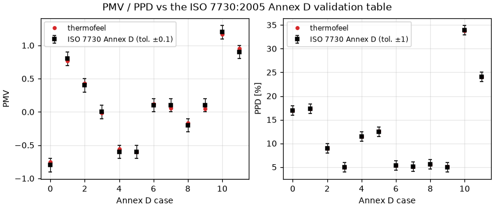
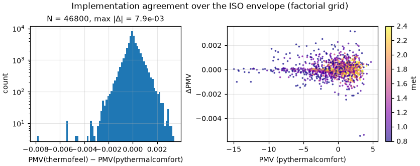
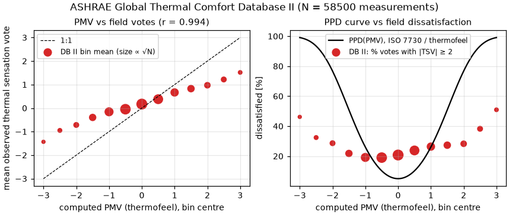

# Validation: `calculate_pmv` / `calculate_ppd`

Fanger's **Predicted Mean Vote** and **Predicted Percentage of Dissatisfied**
as standardised in ISO 7730:2005 (Fanger 1970, *Thermal Comfort*,
McGraw-Hill). thermofeel implements the Annex D algorithm with a vectorised
fixed-point iteration for the clothing-surface temperature (tolerance
0.00015, ≤ 150 sweeps; non-converged elements → NaN).

## Validation design

| Part | Question | Reference |
|---|---|---|
| A | Does it reproduce the standard? | The 12-case **ISO 7730:2005 Annex D validation table**, with the table's own tolerances (±0.1 PMV, ±1 PPD), as machine-read from the [validation-data-comfort-models](https://github.com/FedericoTartarini/validation-data-comfort-models) repository |
| B | Does an independent implementation agree everywhere? | **pythermalcomfort** 4.0.2 (CBE Berkeley; Tartarini & Schiavon 2020, [doi:10.1016/j.softx.2020.100578](https://doi.org/10.1016/j.softx.2020.100578)) `pmv_ppd_iso(model="7730-2005")`, limits/rounding disabled, over a 46 800-point factorial grid spanning the ISO envelope (tdb 10–34 °C, tr−ta ±6 K, vr 0.05–1.2 m s⁻¹, RH 20–80 %, met 0.8–2.4, clo 0.3–1.5), plus the PPD closed form on identical PMV |
| C | Is it sane on *real* measured environments, against *real votes*? | **ASHRAE Global Thermal Comfort Database II** (Földváry Ličina et al. 2018, [doi:10.1016/j.buildenv.2018.06.022](https://doi.org/10.1016/j.buildenv.2018.06.022); data [doi:10.6078/D1F671](https://doi.org/10.6078/D1F671)): 109 033 field records → 58 500 with complete (ta, tr, vel, rh, met, clo, vote); vr from the ISO body-movement correction (`pythermalcomfort.utilities.v_relative`) |

Pre-registered criteria: A — all 12 cases within the table tolerances;
B — max |ΔPMV| ≤ 0.05, max |ΔPPD| ≤ 1, PPD-formula max |Δ| ≤ 1e-9, zero
non-converged elements; C (implementation part) — max |ΔPMV| ≤ 0.05.
The vote comparison itself is **informational**: deviations between PMV and
field sensation votes are a documented property of Fanger's *model*, not of
any implementation of it.

## Results

### A — ISO 7730:2005 Annex D: 12/12 within tolerance

max |ΔPMV| = **0.053** (allowed 0.1), max |ΔPPD| = **0.07** (allowed 1).
Per-case table: [`results/pmv_iso7730_annexd.csv`](results/pmv_iso7730_annexd.csv).



### B — independent implementation, ISO envelope

N = 46 800; **max |ΔPMV| = 7.9e-3**, RMSE(ΔPMV) = 6.3e-4; **max |ΔPPD| =
0.18**; PPD closed form on identical PMV: **max |Δ| = 0** (bit-identical);
**0 non-converged**. The residual ΔPMV traces both codes' independent
stopping rules for the same Annex D fixed-point iteration (tolerance
1.5e-4 on the clothing temperature), i.e. it is iteration noise, an order of
magnitude below the ±0.1 conformance tolerance and two orders below PMV's
practical resolution.



### C — 58 500 real measured environments (DB II)

- Implementation agreement on field inputs: **max |ΔPMV| = 7.3e-3**
  (stats: [`results/pmv_agreement_stats.csv`](results/pmv_agreement_stats.csv)).
- Computed PMV vs observed mean sensation vote, 0.5-wide PMV bins (N ≥ 100):
  correlation of bin means **r = 0.994** — monotone and well-ordered.
- The bin means fall *below* the 1:1 line at the extremes (mean |vote| <
  |PMV|), and the empirical dissatisfied fraction at PMV = 0 is ~19–21 %
  against the curve's 5 % floor. Both regressions to the mean are
  **textbook findings** for PMV on field data — cf. the adaptive-comfort
  literature and Humphreys & Nicol (2002),
  [doi:10.1016/S0378-7788(02)00018-X](https://doi.org/10.1016/S0378-7788(02)00018-X)
  — driven by measurement error in met/clo, adaptation, and vote noise. They
  characterise the *model*, identically affecting every conforming
  implementation; the binned table is in
  [`results/pmv_field_ashrae_db2.csv`](results/pmv_field_ashrae_db2.csv).



**Verdict: PASS** (A, B, and the implementation part of C).

## Discussion and limitations

- thermofeel's `calculate_pmv` expects the **relative air velocity at the
  body** (`var`), not the 10 m wind — the docstring is explicit. Part C used
  the ISO body-movement correction vr = v + 0.3(met − 1) for met > 1; users
  applying PMV to NWP output must do an equivalent transformation (as
  `examples/compute-thermal-indices.py` does).
- Humidity enters via the same Antoine-type saturation curve used by ISO
  7730 source code and pythermalcomfort, so the humidity path is not an
  independent degree of freedom in part B — the ISO table (part A) is the
  anchor for absolute conformance.
- PMV is interpretable within roughly ±2 (ISO recommendation); thermofeel
  does not clamp, and the validity envelope is the user's responsibility.
- DB II votes are ordinal, self-reported, and biased toward office
  populations; the vote analysis is deliberately not a pass/fail gate.

## Reproduce

```bash
pip install -e ".[validation]"
python validation/pmv_ppd/validate_pmv_ppd.py
```

Downloads (cached under `validation/_cache/`): the Annex D table JSON (~3 KB)
and the DB II measurements (~3 MB csv.gz, Dryad
[doi:10.6078/D1F671](https://doi.org/10.6078/D1F671)).
