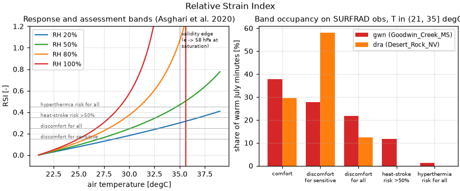

# Validation: `calculate_relative_strain_index`

The **Relative Strain Index** (Lee & Henschel 1966,
[doi:10.1111/j.1749-6632.1966.tb43059.x](https://doi.org/10.1111/j.1749-6632.1966.tb43059.x))
in the peer-reviewed hectopascal closed form stated with units by Asghari et
al. (2020, [doi:10.2174/1874213002013010011](https://doi.org/10.2174/1874213002013010011)):

    RSI = (Ta − 21) / (58 − e)        [Ta in °C, e in hPa]

with `e` the ambient water-vapour pressure. thermofeel computes `e` via its
library-wide BoM Magnus convention
(`calculate_nonsaturation_vapour_pressure`); Asghari et al. print a slightly
different Magnus variant (6.112·10^(7.5T/(237.7+T)) vs 6.105·e^(17.27T/(237.7+T))).

## Validation design

| Part | Question | Method |
|---|---|---|
| 1 | Faithful transcription? | Independent reimplementation with thermofeel's own vapour-pressure convention, in-domain grid (21–35 °C × 10–90 %, N = 4 617) |
| 2 | Does the Magnus-variant choice matter? | Same closed form with the vapour pressure **exactly as printed in the reference**; pre-registered bound max |ΔRSI| ≤ 0.02 (assessment bands are 0.10 wide) |
| 3 | Behavioural correctness? | Boundary identity RSI(21 °C, RH) = 0 ∀RH; strict monotonicity in T and RH for 21 < T ≤ 35 °C; band-crossing reference table; documented domain edge (denominator → 0 as e → 58 hPa) |
| 4 | Sensible on real data? | Band occupancy, humid vs arid station, July 2023, T ∈ (21, 35] °C (informational) |

## Results

- Part 1: max |Δ| = **0** (exact transcription).
- Part 2: max |ΔRSI| = **0.0132** in-domain (RMSE 8.3e-4, bias −3e-4) — an
  order of magnitude inside a band width; the Magnus-variant choice cannot
  move an assessment by one band. Stats:
  [`results/rsi_formula_stats.csv`](results/rsi_formula_stats.csv).
- Part 3: boundary identity exact; strictly increasing in T and RH in-domain.
  Band crossings ([`results/rsi_band_crossings.csv`](results/rsi_band_crossings.csv)):

  | RH % | RSI ≥ 0.15 (sensitive) | ≥ 0.25 (all) | ≥ 0.35 (heat-stroke) | ≥ 0.45 (hyperthermia) |
  |---:|---:|---:|---:|---:|
  | 20 | 28.5 °C | 33.0 °C | 36.9 °C | 40.4 °C |
  | 60 | 26.6 °C | 29.4 °C | 31.6 °C | 33.3 °C |
  | 100 | 25.0 °C | 26.7 °C | 28.1 °C | 29.1 °C |

  These sit where the heat-stress literature expects the discomfort ladder,
  and the humidity dependence is strong, as the index intends.
- Part 4: at Goodwin Creek (humid) most warm minutes land in "discomfort for
  sensitive/all" with a tail into heat-stroke risk; Desert Rock stays lower
  at equal temperatures — the correct humidity ordering.



**Verdict: PASS.**

## Discussion and limitations

- The **domain edge is real and documented**: as e → 58 hPa (saturation near
  35–36 °C) the denominator vanishes, RSI diverges, and beyond it turns
  negative — spurious for a heat index. thermofeel deliberately does not
  clamp (docstring); the response plot shows the asymptote so users see why
  the ~35 °C validity edge matters. Gates here are evaluated in-domain only.
- A different literature form ((10.7 + 0.74(Ta − 35))/(44 − Pa), likely mmHg)
  exists in secondary sources; it is *not* implemented and *not* validated
  here — matching the docstring's variant caveat.
- Categories are those of Asghari et al. (2020); de Garín & Bejarán (2003,
  [doi:10.1007/s00484-003-0175-1](https://doi.org/10.1007/s00484-003-0175-1))
  demonstrate the index's epidemiological relevance (Buenos Aires mortality).

## Reproduce

```bash
pip install -e ".[validation]"
python validation/relative_strain_index/validate_rsi.py
```

Downloads (cached): SURFRAD gwn+dra July 2023 (~25 MB).
