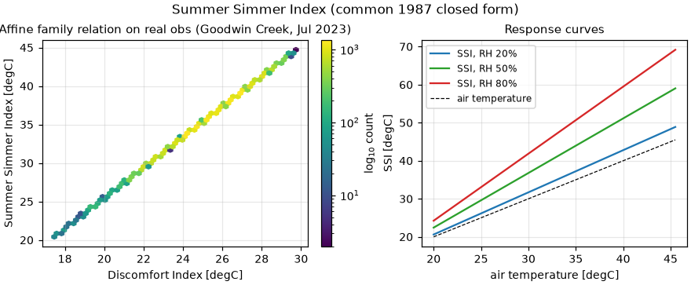

# Validation: `calculate_summer_simmer_index`

Pepi's **Summer Simmer Index** in the common 1987 closed form, evaluated in
Fahrenheit:

    SSI = 1.98 (T_F − (0.55 − 0.0055 RH)(T_F − 58)) − 56.83

Reference: Pepi (1987), *Weatherwise* 40(3), 143–145,
[doi:10.1080/00431672.1987.9933356](https://doi.org/10.1080/00431672.1987.9933356).

**Provenance caveat (stated in the docstring and CHANGELOG):** the 1987
article is not openly available, and public secondary sources disagree with
each other. This validation therefore has an unusual job: verify the
implementation is a faithful transcription of the *common closed form*, prove
its structural identities, and **quantify** the secondary-source disagreement
rather than hide it.

## Validation design

| Part | Question | Method |
|---|---|---|
| 1 | Faithful transcription? | Independent transcription of the closed form (vCalc equation page) over T −10…50 °C × RH 0…100 % |
| 2 | Structural identities? | SSI_F = 1.98·THI_F − 56.83 exactly, with THI_F Thom's index at the 58 °F pivot; quantified family offset vs `calculate_discomfort_index` (14.5 °C = 58.1 °F pivot) |
| 3 | How big is the provenance disagreement? | Closed form evaluated at anchor points quoted by summersimmer.com (Pepi's narrative and the later "New SSI" table) — informational |
| 4 | Sensible on real data? | SSI vs DI on humid July observations (SURFRAD Goodwin Creek) — informational |

Pre-registered criteria: parts 1–2 ≤ 1e-9 °F.

## Results

- Part 1: max |Δ| = **2.1e-13 °F** (N = 12 221).
- Part 2: affine identity holds to **2.1e-13 °F**; family offset
  |DI_F − THI_F| ≤ **0.055 °F** over the whole grid (the 14.5 °C vs 58 °F
  pivot difference — the two indices are the same family to < 0.06 °F).
- Part 3 ([`results/ssi_provenance_anchors.csv`](results/ssi_provenance_anchors.csv)):

  | Anchor | Quoted SSI (°F) | Closed form | Δ |
  |---|---:|---:|---:|
  | 90 °F / 50 % — Pepi narrative | 100 | 103.9 | +3.9 |
  | 90 °F / 50 % — "New SSI" table | 106 | 103.9 | −2.1 |
  | 100 °F / 50 % — "New SSI" table | 120 | 118.3 | −1.7 |

  The closed form sits *between* the two public secondary traditions and a
  few °F from either — consistent with the docstring's warning that the
  implemented equation is the common 1987 closed form, **not** the author's
  later tabulated "New SSI". Users needing the latter must not use this
  function.
- Part 4: on 44 640 humid-July observations the SSI–DI relation collapses to
  the expected near-affine curve; response curves show the design pivot
  (58 °F: SSI = T_F at all humidities) and the strong humidity
  amplification above it.



**Verdict: PASS** (transcription and structure; provenance uncertainty
quantified and documented, in agreement with the library's own caveat).

## Discussion and limitations

- SSI carries **medium confidence by provenance**, not by implementation: the
  implementation is exact for the stated equation, but the equation's own
  lineage has a few-°F spread across secondary sources. The docstring says
  this; the numbers above give it a magnitude.
- Like DI, it ignores wind and radiation and is a warm-season indicator;
  values below the 58 °F pivot are extrapolation and not meaningful.

## Reproduce

```bash
pip install -e ".[validation]"
python validation/summer_simmer_index/validate_ssi.py
```

Downloads (cached): SURFRAD gwn July 2023 (~12 MB).
